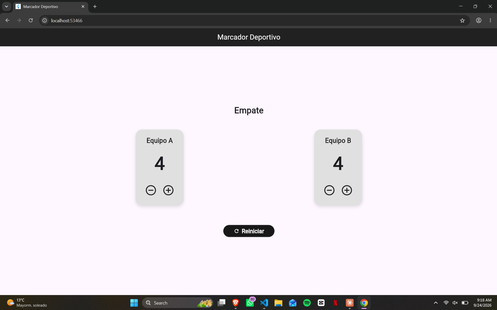
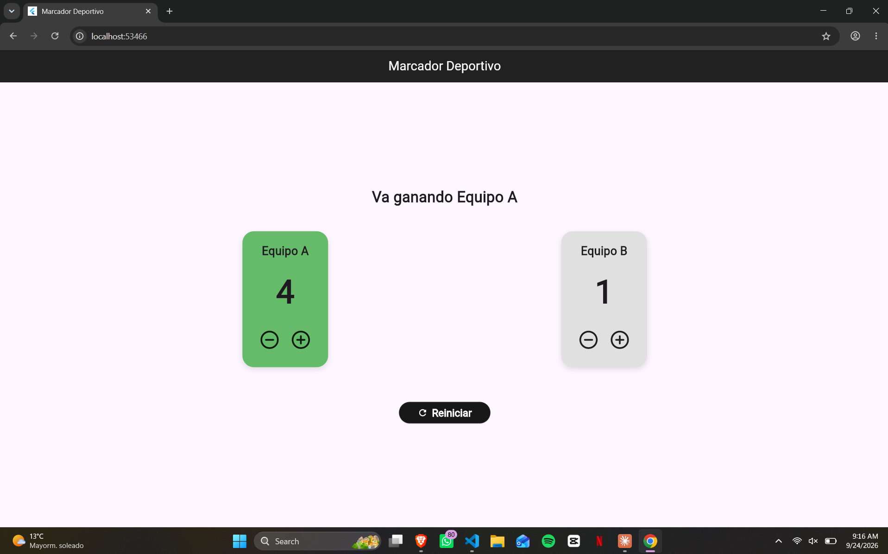

# marcador

# Entrega: Laboratorio Marcador Deportivo

*(Captura de pantalla del empate)*

*(Captura de pantalla de un equipo ganando)*

### Pregunta de comprensión:
**¿Qué hace setState cuando presiona un botón y qué ocurriría si cambia los puntos sin llamarlo?**

Cuando presiono un botón (como +1 o -1), la función `setState` le avisa a Flutter que una variable del estado interno del `StatefulWidget` (en este caso, los puntos de los equipos) ha cambiado. Esto provoca que Flutter vuelva a ejecutar el método `build`, redibujando la interfaz para mostrar los nuevos valores y colores calculados.

Si yo modificara la variable de los puntos directamente (por ejemplo, haciendo `scoreA++;`) pero sin envolver esa instrucción dentro de `setState`, el valor de la variable en la memoria sí cambiaría, pero **la pantalla no se actualizaría**. El marcador seguiría mostrando visualmente los mismos puntos anteriores porque Flutter jamás se enteró de que debía redibujar la interfaz con la nueva información.